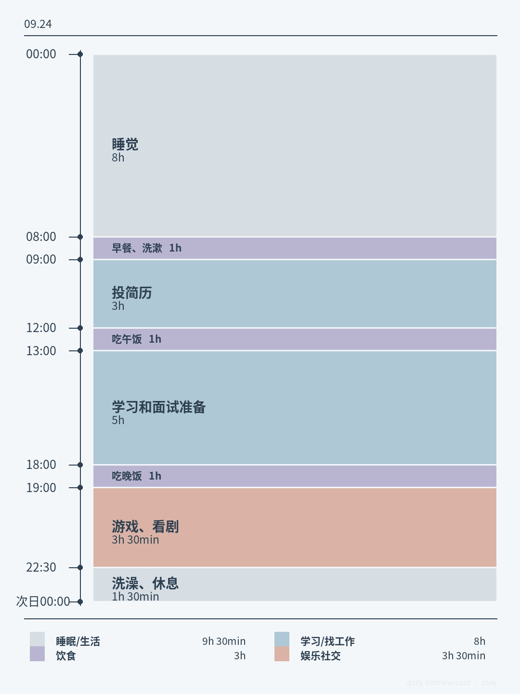

# 一日时间轴卡片（daily-timeline-card）

把自然语言描述的一天日程，生成一张按活动时长等比例绘制的时间轴图片。

当前版本：`v1.0.0`  
作者：`zoeyzh`



## 能做什么

- 检查日程中的空缺、重叠和跨零点问题；
- 使用「睡眠/生活、学习/找工作、饮食、娱乐社交」四类活动；
- 在生成前确认活动分类、标题、隐私、配色和图片比例；
- 输出严格按分钟等比例绘制的 `3:4` 或 `1:1` 时间轴；
- 支持原文显示或轻度概括隐私信息；
- 默认使用雾蓝日常配色，也支持自定义配色。

## 安装方式一：让 Codex 从 GitHub 安装

复制本仓库网址并发送给 Codex：

```text
请检查并安装这个 GitHub 仓库中 daily-timeline-card/ 目录里的 Skill：
https://github.com/你的用户名/daily-timeline-card

安装前请先检查文件结构和脚本安全性。
```

不同账号或产品对 Skill 的安装支持可能不同。如果无法从仓库安装，请使用下面的 ZIP 方式。

## 安装方式二：下载 ZIP

1. 打开仓库的 **Releases** 页面；
2. 下载 `daily-timeline-card-v1.0.0.zip`；
3. 在支持上传 Skill 的 ChatGPT 或 Codex 环境中上传 ZIP；
4. 安装完成后，在对话中调用 `daily-timeline-card`。

不要直接把整个 GitHub 仓库 ZIP 当作 Skill 上传；Release 中的 Skill ZIP 才是安装包。

## 使用方法

用户可以像发消息一样输入日程，不需要自行填写分类、颜色或表格：

```text
09.23  3:00-11:30 睡觉  11:30-12:00 玩手机
12:00-12:40 吃早午饭  12:40-14:40 玩游戏
14:40-17:30 搞简历  17:30-18:30 吃晚饭
18:30-21:30 玩手机  21:30-22:00 洗澡
22:00-3:00 玩手机
```

Skill 会依次完成：

1. 时间检查；
2. 活动分类确认；
3. 标题、隐私、配色和比例选择；
4. 生成前确认；
5. 输出 PNG 时间轴图片。

## 运行要求

- Python 3；
- 生成 PNG 需要 Pillow；
- 如果环境缺少 Pillow，渲染程序可以生成 SVG，但 SVG 中的文字可被直接读取；
- Skill 不会在运行时下载字体或其他素材。

手动检查配置：

```bash
python3 daily-timeline-card/scripts/render_timeline.py schedule.json --check
```

生成 PNG：

```bash
python3 daily-timeline-card/scripts/render_timeline.py schedule.json --png timeline.png
```

## 隐私说明

- 建议不要在公开图片中保留姓名、学校、公司、地点、联系方式或订单信息；
- 「轻度概括」只减少导出图片中的信息暴露，不会删除已经输入到对话里的内容；
- 仓库不收集、上传或保存用户日程；
- 请勿把包含真实日程的临时 JSON 或生成图片提交到仓库。

## 仓库结构

```text
.
├── README.md
├── LICENSE
├── VERSION
├── docs/
├── licenses/
└── daily-timeline-card/
    ├── SKILL.md
    ├── agents/
    ├── assets/
    ├── references/
    └── scripts/
```

## 版权

Skill 的原创说明、工作流程、渲染代码和视觉规范由 `wingzheng2` 保留权利。允许个人、非商业用途安装和使用未经修改的版本；重新发布、出售、提供付费服务、制作衍生版本或移除署名，需要事先获得许可。完整条款见 [LICENSE](LICENSE)。

内嵌字体数据来自 Noto Sans CJK 的轻量子集，适用的第三方授权见 [licenses/NotoSansCJK-LICENSE.txt](licenses/NotoSansCJK-LICENSE.txt)。

